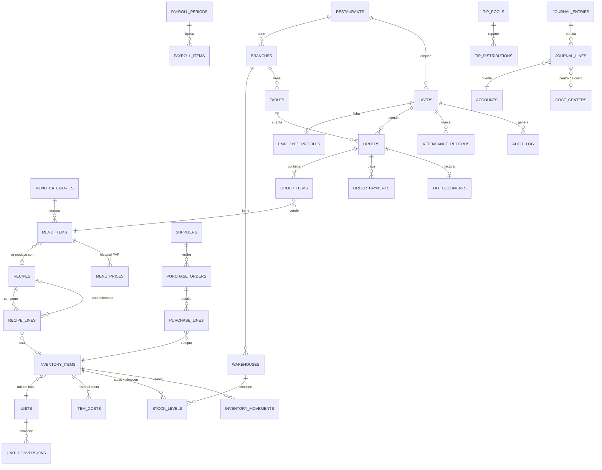
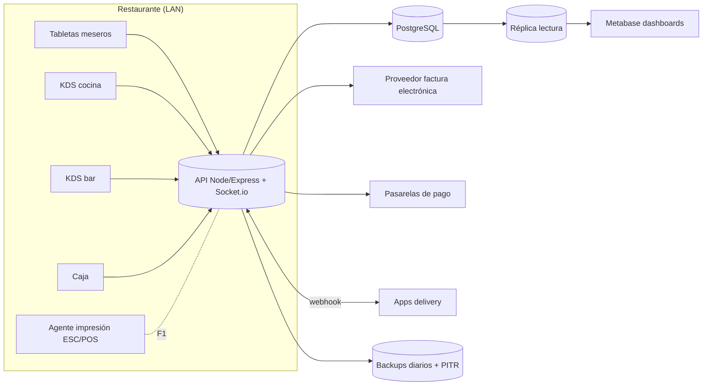
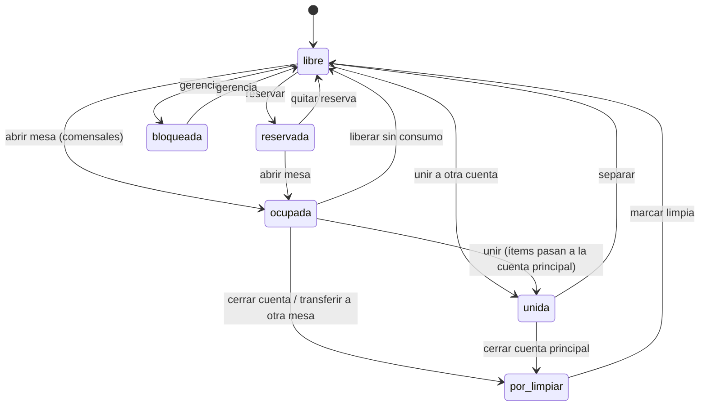

# Sistema integral para restaurante, bar y cocina — "Living"

**Un solo sistema, una sola base de datos, un solo fin: rentabilidad, control y trazabilidad.**

Documento de diseño elaborado como equipo interdisciplinario (arquitectura de software, ingeniería de datos, contaduría, nómina y talento humano, chef ejecutivo / costos, gerencia de restaurante y bar, BI y auditoría de procesos).

> **Cómo leer este documento.** Cada afirmación lleva una etiqueta:
>
> | Etiqueta | Significado |
> |---|---|
> | **[DATO]** | Leído textualmente en el archivo recibido (se indica la página del PDF). |
> | **[FÓRMULA]** | Fórmula o criterio que se deduce de las cifras del archivo (se muestra el cálculo). |
> | **[SUPUESTO]** | No está en el archivo; se asume para avanzar y debe confirmarse. |
> | **[RECOMENDACIÓN]** | Propuesta del equipo. |
> | **[IMPLEMENTADO]** | Ya existe en el código de este repositorio (rama `claude/living-restaurant-system-jxwjgr`). |
> | **[PENDIENTE]** | Requiere información o desarrollo posterior. |

---

## Índice

0. [Resumen ejecutivo](#0-resumen-ejecutivo)
1. [Preguntas críticas y supuestos de trabajo](#1-preguntas-críticas-y-supuestos-de-trabajo)
2. [Diagnóstico del archivo actual](#2-diagnóstico-del-archivo-actual)
3. [Modelo entidad-relación y diccionario de datos](#3-modelo-entidad-relación-y-diccionario-de-datos)
4. [Reglas de negocio y fórmulas](#4-reglas-de-negocio-y-fórmulas)
5. [Arquitectura técnica](#5-arquitectura-técnica)
6. [Especificación de módulos](#6-especificación-de-módulos)
7. [Dashboards por rol](#7-dashboards-por-rol)
8. [KPIs, metas, alertas y acciones](#8-kpis-metas-alertas-y-acciones)
9. [MVP y roadmap por fases](#9-mvp-y-roadmap-por-fases)
10. [Plan de migración y limpieza de datos](#10-plan-de-migración-y-limpieza-de-datos)
11. [Matriz de riesgos y controles internos](#11-matriz-de-riesgos-y-controles-internos)
12. [Facturación de mesas (30 mesas + terraza)](#12-facturación-de-mesas-30-mesas--terraza)
13. [Matriz de accesos por departamento](#13-matriz-de-accesos-por-departamento)
14. [Anexos: parámetros por país, API implementada, plantillas](#14-anexos)

---

## 0. Resumen ejecutivo

**Qué se recibió.** Un PDF de 17 páginas titulado *"NUEVO costos RECETARIO A&B DE RESTAURANTE 2019 (Autoguardado)"*. **No se recibió el archivo `RECETAS LIVING 2020.xlsx`** ni las hojas `PERSONAL`, `COSTO RRHH`, `MATRIZ PVP`, `HISTORICO PVP`, `PVP 010721`, `PVP150821`, `PVP131021`, `TABLA RENDIMIENTO`. El diagnóstico de la sección 2 se basa solo en el PDF; lo que dependa de esas hojas está marcado **[PENDIENTE]**.

**Hallazgos principales del recetario (detalle en §2):**

1. **El mismo insumo tiene costos distintos en recetas distintas.** El "solomo de cuerito" figura a 250.000 Bs/kg en la Paella y a 12.000 Bs/kg en la Parrilla Mar y Tierra; el pollo a 5.500 Bs/kg en casi todo y a 17.335,53 Bs/kg en la Parrilla Mar y Tierra; las papas fritas a 14.000, 4.200 "RAC" o 4.200 "KG" según el plato. No existe una tabla maestra de insumos: cada receta tiene su propia copia del precio.
2. **Cadenas de error (#ERROR!) que llegan hasta la lista de precios**: Ración de Tequeños, Solomo a la Plancha y Ración de Deditos de Queso. Este último aparece como `#ERROR!` en la lista de PVP (pág. 15).
3. **Líneas con cantidad o costo vacíos que valen cero sin avisar**: el pollo de la Ensalada César, las papas de la Paella, los vegetales del Pernil y la batata de la Parrilla Mar y Tierra. Tiramisú y Milanesa de Pollo (versión 1) tienen **PVP = 0**.
4. **Criterio de precio no uniforme**: la regla general es *(ingredientes × 1,25 misceláneos) × 2*, pero hay platos con misceláneos al 30 % aunque la etiqueta dice 25 %, un plato con "beneficio bruto 55 %" y uno con un multiplicador de 1,2 rotulado como "100 %".
5. **Los "contornos adicionales" se venden al costo**: Arroz a 2.313 y Puré a 1.726 en la lista de precios, que coinciden con sus costos por ración (2.312,50 y 1.726,25). El margen de esos productos es cero.
6. **Los misceláneos se cobran dos veces**: las subrecetas (salsas, crema inglesa) ya incluyen el 25 % y los platos que las usan vuelven a sumar 25 % sobre ese costo.

**Qué se entrega:**

- Este documento con los 12 entregables.
- **Código funcionando en el repositorio [IMPLEMENTADO]:**
  - Ventana del mesero: plano de mesas por zona (salón con mínimo 30 mesas, terraza configurable, barra, VIP y delivery) con los 6 estados de mesa.
  - Menú costeado y recetado con botones **Incluir**, **Modificar** y **Anular**, modificadores para cocina y asignación de comensal.
  - Precuenta imprimible.
  - Descuentos y cortesías con PIN de supervisor.
  - Unir, separar y transferir mesas, y pasar ítems de una mesa a otra.
  - Cobro con pagos parciales: dividido por comensal, por ítem, por monto o en partes iguales, con varias formas de pago, propina y vuelto.
  - Cierre de cuenta y emisión de factura.
  - Roles por departamento con matriz de permisos y clave individual, bloqueo por intentos fallidos, expiración de contraseña y bitácora de auditoría (antes/después, IP, quién autorizó).
  - KDS de cocina y bar por estación.
  - Costo teórico guardado en cada venta (base para comparar costo real contra teórico).
  - Migraciones versionadas probadas en SQLite y PostgreSQL.

---

## 1. Preguntas críticas y supuestos de trabajo

Mientras no haya respuesta se trabaja con el supuesto de la tercera columna. Todos estos supuestos son parámetros configurables en el sistema, no decisiones fijas.

| # | Pregunta | Por qué importa | Supuesto de trabajo |
|---|---|---|---|
| 1 | **País y jurisdicción fiscal.** Las cifras están en "Bs." ([DATO] pág. 15), lo que sugiere Venezuela. ¿Es correcto? ¿Hay operaciones en otro país? | Define impuestos, facturación legal, nómina y moneda. | Venezuela, una razón social. El sistema queda multi-país. |
| 2 | **Moneda funcional y de referencia.** ¿Se fija el precio en USD y se cobra en Bs. a tasa BCV? ¿Se aceptan divisas? | Con inflación alta, costear en Bs. pierde vigencia en días. El costo debe guardarse en la moneda estable y convertirse al cobrar. | Costos y precios de referencia en USD; cobro en Bs. y en divisas con tasa del día **[PENDIENTE: módulo multimoneda, Fase 2]**. |
| 3 | **Reconversión monetaria.** Las hojas `PVP 010721`, `PVP150821` y `PVP131021` cruzan el 01/10/2021. ¿`PVP131021` ya está en bolívares digitales (÷ 1.000.000)? | Si no se normaliza, el histórico mezcla escalas. | Sí. Se normaliza todo a la moneda de referencia al migrar. |
| 4 | **¿Los precios de carta incluyen IVA?** ¿Tasa 16 %? ¿Se cobra 10 % de servicio? ¿Aplica IGTF a pagos en divisas? | Cambia el cálculo de la cuenta y la factura. | Precio sin IVA, IVA 16 %, propina voluntaria sugerida 10 %. El sistema ya soporta precio con o sin IVA incluido (`prices_include_tax`). |
| 5 | **Medio de facturación legal.** ¿Máquina fiscal homologada o imprenta / proveedor digital autorizado por el SENIAT? ¿Cuál? | Sin proveedor autorizado, la factura del sistema no tiene validez fiscal. | Se integra el proveedor que indiquen. Mientras tanto, el sistema emite un documento interno marcado como borrador. |
| 6 | **Política de margen.** ¿Food cost objetivo por categoría? ¿Se mantiene el recargo de "misceláneos 25 %"? | Hoy el precio es 2,5 × ingredientes, con excepciones. | Food cost objetivo 30 % en cocina y 20–24 % en bar; misceláneos como % configurable aplicado una sola vez (§4). |
| 7 | **Tamaño**: sucursales, puntos de venta (bares), almacenes, empleados por área. | Dimensiona la arquitectura y la nómina. | 1 sucursal, 1 bar, 2 almacenes (cocina y bar), menos de 60 empleados. |
| 8 | **Mesas**: número exacto en terraza, puestos de barra, mesas VIP y capacidad de cada una. | Plano y reportes de rotación. | Salón 30 (mínimo), terraza 10, barra 6, VIP 0. Se ajusta en pantalla (Mesas → Configurar zonas). |
| 9 | **POS y hardware actual**: tabletas, impresoras de comanda (80 mm), pantalla de cocina, datáfonos. | Integración e impresión. | Tabletas con navegador e impresora térmica en cocina y bar **[PENDIENTE: agente de impresión ESC/POS]**. |
| 10 | **Nómina**: ¿semanal o quincenal? ¿Cestaticket? ¿Cómo se reparten las propinas (por puntos, igualitario, por área)? ¿Hay horas extra recurrentes? | Cálculo legal y de costo laboral. | Quincenal, régimen LOTTT, reparto de propinas por puntos según cargo. |
| 11 | **Contabilidad**: ¿plan de cuentas actual? ¿software contable? ¿contador interno o externo? | Asientos automáticos y cierres. | Plan de cuentas base (§6.6), exportable al software del contador. |
| 12 | **Delivery**: ¿qué plataformas se usan y con qué comisión? | Margen por canal. | Delivery propio más una plataforma, comisión configurable. |
| 13 | **¿Quién tiene la clave de autorización especial** (anulaciones, descuentos, cortesías)? | Segregación de funciones. | Gerencia y administrador. Se puede agregar el rol "Jefe de salón". |
| 14 | **Consumo de personal y cortesías**: ¿límite mensual? | Control de fugas. | Máximo 2 % de ventas en cortesías; comida de personal costeada aparte. |
| 15 | **El Excel 2020 y las hojas faltantes** (PERSONAL, COSTO RRHH, MATRIZ PVP, TABLA RENDIMIENTO, LISTADO COMPRA). | Completar diagnóstico y migración. | Pendiente de recibir el `.xlsx` original, no un PDF (las fórmulas solo se auditan en el archivo nativo). |

---

## 2. Diagnóstico del archivo actual

### 2.1 Estructura encontrada

| Pág. | Contenido [DATO] | Observación |
|---|---|---|
| 1 | Listado de compras "PRODUCTOS / CARNES / CANT / COMPRAS DICIEMBRE / SUB TOTAL", total **16.313.199** | Las filas se imprimieron como barras negras (relleno oscuro o filas comprimidas). Solo se lee "PERAS" con subtotal 0. **No se pueden auditar las líneas.** |
| 2–3 | Desayunos (Continental, Margariteño, Criollo con mechada, Criollo con pollo, Americano, Tortilla, Ración de huevo con arepa, Empanadas, Sándwich, Arepas) y bebidas calientes; costeo de "desayuno solo con empanadas", almuerzo y cena de ejecutivos de guardia | Incluye costeos de comidas de personal o eventos mezclados con la carta. |
| 4 | Ensaladas (Vuelve a la Vida, Aquarius, Capresa Tropical, Rallada/Mixta en 2 versiones, César) | — |
| 5 | Sopas, Ración de Tequeños, Empanadas variadas | Tequeños con `#ERROR!`. |
| 6–8 | Principales: Salsa a la criolla, Pernil, Solomo, Parrilla mixta, Milanesas, Bisteck, Pollos, Pescados, Paella, Parrilla mar y tierra | Mayor concentración de errores. |
| 9 | Pastas | Las filas de ingredientes no se ven; solo los totales. |
| 10 | Postres | Tiramisú en 0; título duplicado. |
| 11 | Lunchería: hamburguesas, club house, sándwich, parrilla salteada, deditos, tequeños ×80 | Bloque vacío titulado "0". |
| 12–14 | Producciones (batch) ×10, ×15, ×20 y ×30 raciones: mechada, caraotas, caldos, contornos, salsas, tortas | Son las **subrecetas**. |
| 15 | **Lista de PVP** por categoría | No hay columna de costo ni de food cost. |
| 16 | Menú semanal / ejecutivo (lunes a domingo) | Ilegible a esa escala. |
| 17 | Subrecetas de salsas ×20 raciones | La mayoría con filas ocultas. |

### 2.2 Fórmula de precio que usa hoy el archivo

**[FÓRMULA]** En casi todos los bloques se repite el mismo patrón:

```
Costo de los ingredientes        = Σ (cantidad × costo unitario)
Misceláneos 25 %                 = Costo ingredientes × 0,25
COSTO PRODUCTO                   = Costo ingredientes × 1,25
Beneficio Bruto (100 %)          = COSTO PRODUCTO × 1,00
Precio Sugerido de Venta         = COSTO PRODUCTO × 2  = Costo ingredientes × 2,5
```

Comprobaciones:

- Empanadas variadas (pág. 5): 52.900 × 1,25 = 66.125 → PVP 132.250.
- Pesca a la marinera (pág. 8): 42.839,38 × 1,25 = 53.549,22 → PVP 107.098,44.

**Qué significa.** El food cost teórico sobre ingredientes es 1 / 2,5 = **40 %**, y sobre el "costo producto" con misceláneos es **50 %**. Es alto para restaurante (la referencia es 28–35 %) y además el precio no incluye IVA (**[PENDIENTE]** confirmar, pregunta 4).

**Sobre `=costo/30%` del Excel 2020 [PENDIENTE de ver la hoja].** Dividir el costo entre 30 % es lo mismo que dividir entre 0,30, es decir, **food cost objetivo de 30 %** (precio = 3,33 × costo, margen bruto de 70 %). **No es** un margen de 30 %: eso sería costo / 0,70 (precio = 1,43 × costo). Si en unas hojas se usa costo/0,30 y en otras ×2, la carta mezcla food costs de 30 % y de 50 %. En §4.3 se fija un solo criterio.

### 2.3 Errores e inconsistencias detectados (con evidencia)

| # | Tipo | Dónde [DATO] | Evidencia | Impacto |
|---|---|---|---|---|
| E1 | **Mismo insumo, costos distintos** | Paella vs Parrilla mar y tierra (pág. 8) | Solomo de cuerito a 250.000 Bs/kg en la Paella y a 12.000 Bs/kg en la Parrilla (20,8 veces menos). Pollo a 5.500 Bs/kg en las demás recetas y a 17.335,53 Bs/kg en la Parrilla. | La Parrilla mar y tierra para 2 personas sale a PVP 99.386,24, menos que la Pesca a la marinera de 1 persona (107.098,44) y menos de la mitad de la Paella para 2 (217.756,25). **Plato subvalorado.** |
| E2 | Mismo insumo con 3 precios y 2 unidades | Papas fritas | "PAPAS FRITAS RAC 14.000" (Solomo, Parrilla mixta, Milanesa de carne); "PAPAS FRITAS RAC 4.200" (Pernil, pollos, pescados); "PAPA FRITA KG 4.200" (Paella, Pescado al ajillo); "PAPA FRITA KG 14.000" (Parrilla mar y tierra) | El costo depende de qué receta se copió. |
| E3 | Unidad que no corresponde al precio | Pescado al ajillo y Pescado a la plancha (pág. 8) | "PESCADO **RAC** 150.000" con cantidad 0,22 o 0,20: el precio es por kg pero la unidad dice ración. | Confusión en inventario: no se sabe si se descuentan 0,2 kg o 0,2 raciones. |
| E4 | Unidad que no corresponde al precio | Pescado a la plancha | "ARROZ **KG** 2.312,50" con 0,15 → 346,8. En el resto de recetas el arroz es "RAC 2.312,50" (costo por ración). | Arroz subcosteado: se toma el 15 % de una ración. |
| E5 | Unidad errada | Pesca a la marinera | Palometa con unidad "**KL**". | Normalizar a "KG". |
| E6 | **#ERROR! en cadena** | Ración de Tequeños (pág. 5), Solomo a la plancha (pág. 6), Ración de deditos de queso (pág. 11) | "TEQUEÑOS UNIDAD #ERROR!"; "MANTEQUILLA FINAS HIERBAS RAC #ERROR!". La subreceta "Mantequilla finas hierbas ×30" sí existe en la pág. 13: la referencia está rota. | **La lista de PVP muestra "DEDITOS DE QUESO #ERROR!"** (pág. 15). |
| E7 | Cantidad vacía = costo 0 sin aviso | Ensalada César c/pollo (pág. 4) | "POLLO KG 5.500" sin cantidad → 0. | Plato con pollo costeado como si no lo tuviera. |
| E8 | Cantidad vacía = costo 0 | Paella (pág. 8) | "PAPA FRITA KG 4.200" sin cantidad → 0,0. | Subcosteo. |
| E9 | Cantidad vacía = costo 0 | Pernil en salsa de naranjas (pág. 6) | "VEGETALES MIXTOS RAC 1.726,25" sin cantidad → 0,00. | Subcosteo. |
| E10 | Costo vacío | Parrilla mar y tierra (pág. 8) | Sal, pimentón y batata sin costo → 0. | Subcosteo. |
| E11 | Cantidad 0 | Milanesa de pollo (pág. 7) | Harina de trigo 0,000; salsa tomate 0. | Subcosteo. |
| E12 | Fila sin descripción con costo | Salsa a la criolla (pág. 6) | Primera fila: cantidad 0,000, "KG 250.000", sin nombre. | Fila basura que puede activarse por error. |
| E13 | **Plato con PVP 0** | Tiramisú (pág. 10) | "TIRAMISU RAC" sin costo → COSTO PRODUCTO 0 → PVP 0,00. Sin embargo, la subreceta "TIRAMISÚ X 10 PERSONAS" sí está costeada (pág. 13). | Referencia no enlazada. |
| E14 | Plato con PVP 0 (duplicado) | Milanesa de pollo (pág. 6) | Versión 1 con todos los costos en blanco → PVP 0,0. La versión 2 (pág. 7) da 38.276. | Recetas duplicadas: no se sabe cuál es la oficial. |
| E15 | **Misceláneos distinto al rotulado** | Parrilla mixta ×2 pax (pág. 6) | Dice "Misceláneos 25 %", pero 10.860 / 36.200 = **30 %**. | Criterio oculto. |
| E16 | **"Beneficio bruto 100 %" que no es 100 %** | Parrilla mixta ×2 pax | Beneficio 56.472 = 47.060 × **1,2**; PVP 103.532. | Criterio oculto. |
| E17 | Margen distinto | Bisteck de solomo a la criolla (pág. 6) | Misceláneos 17.460 = 30 %; "BENEFICIO BRUTO 55 %" 41.613 → PVP 117.272. | Política no uniforme. |
| E18 | Misceláneos omitido | Pernil (pág. 6) | Misceláneos en blanco → COSTO PRODUCTO = costo ingredientes (15.435,69). | Subcosteo de 25 % frente a los demás platos. |
| E19 | Totales que no cuadran | Milanesa de carne (pág. 6) | La suma de líneas visibles es 56.728,2, pero los misceláneos (14.619,5) implican una base de 58.478 (diferencia de 1.749,8). Falta la fila "costo de los ingredientes" y el valor rotulado "Beneficio Bruto" es en realidad el costo producto. | Fórmulas desalineadas o filas ocultas. |
| E20 | **Contornos vendidos al costo** | Lista PVP (pág. 15) | ARROZ 2.313 = costo de la ración (2.312,50); PURÉ 1.726 = costo (1.726,25). | Margen 0 en cada contorno adicional. |
| E21 | **Misceláneos dos veces** | Salsa menier (pág. 17) y Pescado a la menier (pág. 8); Crema inglesa (pág. 17) y tortas (pág. 10) | La subreceta ya suma 25 % (Salsa menier: misceláneos 3.085, subtotal 15.425) y el plato vuelve a sumar 25 %. Sobre el componente de salsa el recargo efectivo es 1,25 × 1,25 = 1,5625. | Sobrecosteo de platos con subrecetas y PVP inflado. |
| E22 | Rendimiento de subreceta mal dividido | Crema inglesa dulce "15 RAC" (pág. 17) | Subtotal 15.016,67 → "PRECIO X RAC 1.073" = 15.016,67 / **14**, no / 15 (sería 1.001,11). | Probable error de divisor (confirmar en el Excel). |
| E23 | Subreceta usada con unidad ambigua | Pescado a la menier | "SALSA MENIER RAC 15.425 × 0,300": 15.425 es el costo del **lote ×20**, pero se rotula "RAC". | Unidad del lote confundida con unidad de porción. |
| E24 | Mismo plato con costos distintos | Torta de chocolate (pág. 10) | Ración de torta de chocolate a 12.787,20 en "Torta de chocolate a la arancia" y a 5.266,67 en el segundo bloque, además titulado por error "RAC DE TORTA DE ZANAHORIA". | Título duplicado y costo incoherente. |
| E25 | Precio de insumo implausible | Mayonesa (págs. 4 y 11) | 385.714 Bs/kg o LT, más cara que el solomo (250.000/kg). En la Ensalada rallada, 0,03 kg de mayonesa = 11.571, el 78 % del costo. | Probable precio por caja o galón cargado como precio por kg. **Explica que la "Tradicional ensalada rallada" cueste 37.284 y la "Ensalada mixta" 8.993.** |
| E26 | Precio de insumo implausible | Sopa viejo pescador (pág. 5) | "RON LT 800" frente a "LIMÓN KG 60.000". | Precio desactualizado. |
| E27 | Coherencia comercial | Lista PVP (pág. 15) | Café negro grande 58.240 > Café con leche grande 56.456; Desayuno americano 14.453 frente a Margariteño 214.204 y Criollo c/carne 312.039 (21 veces más). | Precios calculados con costos de **fechas distintas** (inflación) **[SUPUESTO: confirmar fecha de cada costo]**. |
| E28 | Precios idénticos sospechosos | Lista PVP | Pasta Napoli 6.688 = Pasta al filetto di pomodoro 6.688; en el recetario la Pasta Napoli está vacía (pág. 9). | Precio copiado y sin receta. |
| E29 | Platos en lista sin receta | Lista PVP | Pasta 4 quesos, Desayuno francés, Sopa de pollo (en recetario: "Sopa del día"), Plato de fruta, "De la casa". | No hay trazabilidad del costo. |
| E30 | Recetas sin precio de lista | Recetario | Solomo a la plancha, Pernil, Parrilla mixta, Paella, Pasta Aquarius (PVP 8.996,35 solo en recetario) y otros. | Carta y recetario desalineados. |
| E31 | PVP en subrecetas | Salsa a la criolla (PVP 4.527,5), Salsa guasacaca ("Beneficio Bruto 100 %" = subtotal) | Una subreceta no se vende: no debe tener PVP. | Confusión de conceptos. |
| E32 | Plantillas vacías y basura | Bloque "0" (pág. 11), "Caldo de pollo ×20 RAC" sin costos (pág. 12), "Salsa ajillo" vacía (pág. 17) | — | Ruido en la migración. |
| E33 | Ortografía y nombres | "PESCADO A LA PALANCHA", "BEIDAS CALIENTES", "PIMRNTON", "BOLOGÑA", "MICELANIOS" | — | Rompe búsquedas y deduplicación. |
| E34 | Listado de compras ilegible | Pág. 1 | Barras negras; "PERAS" con subtotal 0; TOTAL COMPRA 16.313.199. | **[PENDIENTE]** auditar en el `.xlsx`. |

### 2.4 Lo que falta (datos que el sistema necesita y el archivo no tiene)

- **Rendimiento y merma por insumo** (peso bruto → neto): `TABLA RENDIMIENTO` se menciona, pero no está en el PDF **[PENDIENTE]**.
- **Fecha de cada costo** y proveedor: sin fecha no se puede saber qué precio está vigente.
- **Unidad de compra frente a unidad de uso** (caja → kg → g; botella → ml → onza).
- **Rendimiento de cada subreceta** (cuántas porciones o litros salen del lote) en un campo, no en el título ("×20 RAC").
- **Categoría, estación (cocina o bar) y tipo** (vendible, subreceta, insumo) de cada ítem.
- **Ventas por plato** (cantidades): sin ellas no hay ingeniería de menú, solo costeo.
- **IVA y moneda** de cada precio.
- **Bar**: el PDF no contiene cócteles, licores ni costeo por onza o trago **[PENDIENTE: ¿están en otra hoja?]**.
- **Personal y costo de RRHH**: hojas no recibidas **[PENDIENTE]**.

### 2.5 Oportunidades rápidas (antes incluso de tener el sistema)

1. Subir el precio de los **contornos adicionales** a costo / 0,30 (E20).
2. Corregir **mayonesa** (E25), **solomo de cuerito** y **pollo** de la Parrilla mar y tierra (E1) y recalcular: impacto directo en precio.
3. Enlazar el **Tiramisú** a su subreceta (E13) y eliminar la Milanesa de pollo duplicada (E14).
4. Aplicar los misceláneos **una sola vez** (E21).
5. Revisar la **Milanesa de carne con solomo** (PVP 146.195): **[RECOMENDACIÓN de chef]** usar un corte de menor costo apto para milanesa (pulpa negra, ganso o bola), con la misma técnica, y bajar el costo de proteína.

---

## 3. Modelo entidad-relación y diccionario de datos

### 3.1 Principios

- **Multi-empresa → sucursal → almacén / punto de venta.** Todo registro operativo lleva `restaurant_id` (tenant) y, desde la Fase 2, `branch_id`.
- **Un insumo, un costo vigente.** Las recetas referencian insumos o subrecetas, nunca copian precios.
- **Ventas con *snapshot***: precio, nombre y **costo teórico** se congelan en cada línea vendida, para auditar costo real contra teórico aunque los precios cambien después.
- **Nada se borra en operación**: se anula con motivo, usuario y autorizador.
- Fechas en ISO‑8601 UTC; montos en `NUMERIC(14,4)` en el modelo objetivo (el MVP usa `DOUBLE PRECISION`) **[RECOMENDACIÓN: migrar a NUMERIC en Fase 2]**.

### 3.2 Diagrama (núcleo)



### 3.3 Diccionario de datos

Estado: **MVP** = existe en el repositorio; **F1 / F2 / F3** = fase del roadmap (§9).

#### Seguridad y organización

| Tabla | Campo | Tipo | Descripción | Estado |
|---|---|---|---|---|
| `restaurants` | `id`, `name`, `country`, `currency`, `currency_symbol` | text | Tenant (empresa). | MVP |
| | `tax_name`, `tax_rate` | text, num | Impuesto principal (IVA 16 %). | MVP |
| | `prices_include_tax` | int 0/1 | 1 = el PVP de carta ya incluye impuesto. | MVP |
| | `tip_suggested_pct` | num | % de propina sugerida en la precuenta. | MVP |
| `branches` | `id`, `restaurant_id`, `name`, `address`, `fiscal_series` | | Sucursal. | F2 |
| `users` | `id`, `restaurant_id`, `name`, `email`, `password_hash` | | Usuario con clave única (bcrypt). | MVP |
| | `role` | enum | admin, gerencia, contaduria, rrhh, cocina, bar, mesero, caja, almacen, auditoria. | MVP |
| | `active`, `failed_attempts`, `locked_until` | | Desactivación inmediata y bloqueo por intentos. | MVP |
| | `auth_pin_hash` | text | PIN de autorización especial (supervisor). | MVP |
| | `password_changed_at`, `last_login_at` | text | Expiración de contraseña y último acceso. | MVP |
| | `totp_secret` | text | 2FA TOTP. | F2 |
| `audit_log` | `user_id`, `user_name`, `user_role`, `action`, `entity`, `entity_id` | | Quién y qué. | MVP |
| | `before_data`, `after_data` | JSON | Antes y después. | MVP |
| | `authorized_by`, `ip`, `user_agent`, `created_at` | | Quién autorizó, desde dónde y cuándo. | MVP |

#### Gastronomía (recetas, costos)

| Tabla | Campo | Tipo | Descripción | Estado |
|---|---|---|---|---|
| `units` | `code` (g, kg, ml, l, und, porcion, botella, copa, oz, trago), `dimension` (masa, volumen, conteo) | | Catálogo de unidades. | F1 |
| `unit_conversions` | `from_unit`, `to_unit`, `factor`, `inventory_item_id` (opcional) | | 1 kg = 1000 g; 1 botella de ron = 750 ml (por insumo); 1 oz = 29,57 ml; 1 trago = 1,5 oz (configurable). | F1 |
| `inventory_items` | `name`, `category`, `unit`, `stock`, `min_stock`, `unit_cost`, `supplier` | | Insumo (MVP: unidad única, costo vigente). | MVP |
| | `purchase_unit`, `purchase_to_base_factor` | | Ej.: compra en caja de 12 und. | F1 |
| | `yield_pct` | num | Rendimiento (peso neto / peso bruto). Ej.: pollo entero 70 %. | F1 |
| | `cost_method` | enum | promedio ponderado, último costo o estándar. | F1 |
| | `reorder_point`, `max_stock`, `station` (cocina/bar) | | Reposición. | F1 |
| `item_costs` | `inventory_item_id`, `cost`, `currency`, `valid_from`, `source` (compra, ajuste) | | Historial de costo con fecha (resuelve E1 y E27). | F1 |
| `recipes` | `name`, `type` (cocina/bar), `notes` | | Ficha técnica (MVP). | MVP |
| | `kind` | enum | plato, cóctel, bebida, subreceta, combo. | F1 |
| | `yield_qty`, `yield_unit` | | Rendimiento del lote (20 porciones, 2 L). Resuelve E22 y E23. | F1 |
| | `misc_pct` | num | % de misceláneos (aplicado **solo** en platos finales). Resuelve E21. | F1 |
| | `prep_time_min`, `photo_url`, `procedure`, `allergens` | | Ficha técnica. | F2 |
| `recipe_lines` (MVP: `recipe_ingredients`) | `recipe_id`, `inventory_item_id`, `quantity` | | Línea de receta. | MVP |
| | `sub_recipe_id` | FK | Permite usar una subreceta como ingrediente (salsa, crema inglesa). | F1 |
| | `unit`, `waste_pct` | | Unidad de la línea y merma propia. | F1 |
| `menu_categories` | `name`, `sort_order` | | Categoría de carta. | MVP |
| `menu_items` | `name`, `price`, `category_id`, `recipe_id`, `available` | | Producto vendible. | MVP |
| | `target_food_cost_pct`, `station`, `channel_prices` | | Food cost objetivo y precio por canal (salón, delivery, happy hour). | F1 |
| `menu_prices` | `menu_item_id`, `price`, `valid_from`, `approved_by` | | **Histórico PVP** (reemplaza `HISTORICO PVP` y `PVP ddmmyy`). | F1 |
| `modifiers` | `name`, `price_delta`, `recipe_delta` | | Modificadores con precio o receta (extra queso). En el MVP son notas de texto. | F2 |

#### Inventario y compras

| Tabla | Campo | Descripción | Estado |
|---|---|---|---|
| `inventory_movements` | `item_id`, `type` (entrada/salida/ajuste), `quantity`, `reason`, `created_by` | Kárdex. El MVP descuenta automáticamente por receta al vender y repone al anular. | MVP |
| | `warehouse_id`, `unit_cost`, `doc_ref` | Valorización y almacén. | F1 |
| `warehouses` | `name`, `type` (cocina, bar, depósito) | Almacenes. | F1 |
| `stock_levels` | `warehouse_id`, `item_id`, `qty` | Stock por almacén. | F1 |
| `transfers` | `from_wh`, `to_wh`, `lines`, `status`, `approved_by` | Transferencias entre almacenes. | F1 |
| `physical_counts` | `warehouse_id`, `counted_at`, `lines(item, teorico, fisico, diferencia)` | Toma física y ajustes autorizados. | F1 |
| `suppliers` | `name`, `tax_id`, `payment_terms`, `rating` | Proveedores. | F1 |
| `purchase_orders`, `purchase_lines` | `supplier_id`, `status`, `item_id`, `qty`, `unit_cost` | Orden de compra, recepción y factura del proveedor. | F1 |
| `production_orders` | `recipe_id`, `batches`, `yield_real`, `waste` | Producción batch (las "×20 raciones"). | F2 |

#### Ventas, mesas y cobro

| Tabla | Campo | Descripción | Estado |
|---|---|---|---|
| `tables` | `name`, `zone` (salon, terraza, barra, vip, delivery), `number`, `capacity` | Mesa. | MVP |
| | `status` | libre, ocupada, por_limpiar, reservada, unida, bloqueada. | MVP |
| | `assigned_waiter_id`, `merged_into`, `occupied_since`, `active` | Mesero asignado, unión de mesas y tiempo de ocupación. | MVP |
| `orders` | `table_id`, `waiter_id`, `channel`, `status`, `opened_at`, `closed_at`, `closed_by` | Cuenta. | MVP |
| | `guests` | Comensales. | MVP |
| | `discount_type` (porcentaje, monto, cortesia), `discount_value`, `discount_reason`, `discount_authorized_by` | Descuento o cortesía autorizada. | MVP |
| | `tip_amount` | Propina total (suma de pagos). | MVP |
| `order_items` | `name_snapshot`, `price_snapshot`, `quantity`, `kitchen_status` | Línea vendida. | MVP |
| | `notes`, `seat` | Modificadores y comensal. | MVP |
| | `status` (activo/anulado), `void_reason`, `voided_by`, `void_authorized_by`, `voided_at` | Anulación trazable. | MVP |
| | `cost_snapshot` | **Costo teórico** de la porción al momento de vender. | MVP |
| `order_payments` | `method`, `amount`, `tip_amount`, `reference`, `payer_label`, `received_by` | Pagos parciales: cuenta dividida. | MVP |
| | `currency`, `fx_rate` | Pago en divisas con tasa del día. | F2 |
| `tax_documents` | número, CUFE / número de control, subtotal, impuesto, total, estado | Factura electrónica (proveedor certificado). | MVP |
| `cash_sessions` | `user_id`, `opened_at`, `opening_cash`, `closing_cash`, `expected`, `difference`, `approved_by` | Apertura y cierre de caja (arqueo). | F1 |
| `customers`, `reservations` | nombre, teléfono, preferencias, visitas, ticket promedio | CRM y reservas. | F2 |

#### Talento humano, nómina y contabilidad

| Tabla | Campo | Descripción | Estado |
|---|---|---|---|
| `employee_profiles` | `position`, `salary_type`, `base_salary`, `hire_date`, `active` | Ficha básica. | MVP |
| | `department`, `cost_center_id`, `contract_type`, `id_number`, `bank_account`, `tip_points` | Ficha completa. | F1 |
| `attendance_records` | `clock_in`, `clock_out` | Marcaje. | MVP |
| `shifts` | `user_id`, `date`, `start`, `end`, `station` | Turnos planificados. | F1 |
| `payroll_periods`, `payroll_items` | período, horas, bruto, deducciones, neto, `details` JSON | Nómina. | MVP (básica) |
| `payroll_concepts` | código, tipo (devengo o deducción), fórmula, país | Parametrización legal por país. | F2 |
| `tip_pools`, `tip_distributions` | período, área, total, puntos, monto por empleado | Reparto de propinas. | F1 |
| `accounts` | código, nombre, tipo, naturaleza | Plan de cuentas. | F2 |
| `cost_centers` | cocina, bar, salón, administración, delivery | Centros de costo. | F1 |
| `journal_entries`, `journal_lines` | fecha, origen (venta, compra, nómina), débito, crédito, centro de costo | Asientos automáticos. | F2 |
| `bank_accounts`, `transactions`, `expense_categories` | | Bancos, gastos e ingresos. | MVP |

---

## 4. Reglas de negocio y fórmulas

### 4.1 Costeo

| Concepto | Fórmula | Nota |
|---|---|---|
| Peso neto | `neto = bruto × rendimiento%` | Rendimiento por insumo (pollo entero ~70 %, pescado entero ~45–55 %, **[SUPUESTO: referencias de industria; usar la TABLA RENDIMIENTO real]**). |
| Costo por unidad neta | `costo_neto = costo_compra / rendimiento%` | El costo real de 1 kg aprovechable. |
| Costo de línea | `cantidad × costo_neto_unitario` (convertido a la unidad de la línea) | Si la línea es subreceta: `cantidad × costo_unitario_subreceta`. |
| Costo de receta (lote) | `Σ costo de líneas` | Recursivo sobre subrecetas, con detección de ciclos. |
| Costo unitario | `costo_receta / rendimiento (porciones o litros)` | Resuelve "÷14 vs ÷15" (E22). |
| Misceláneos | `costo_plato × misc_pct` **solo en el plato final** (sal, aceite de freír, gas, empaque) | Nunca en subrecetas (E21). **[RECOMENDACIÓN]** Medirlo con datos reales en vez de dar un 25 % fijo. |
| Costo del producto | `costo_ingredientes + misceláneos` | |
| Costo real vs teórico | `teórico = Σ (ventas_qty × cost_snapshot)`; `real = inv_inicial + compras − inv_final` (por categoría) | Variación = real − teórico. Meta ≤ 1,5–2 pp del food cost. |

**Conversión de unidades (bar):** `ml_por_trago = oz_receta × 29,5735`; `costo_trago = (costo_botella / ml_útiles_botella) × ml_por_trago`; `ml_útiles = ml_botella × (1 − merma_evaporación_derrame%)` (**[SUPUESTO]** merma de bar del 3–5 %, configurable).

### 4.2 Precio y margen

| Concepto | Fórmula |
|---|---|
| PVP sin IVA por food cost objetivo | `PVP = costo / food_cost_objetivo` (ej.: costo / 0,30) |
| PVP sin IVA por margen objetivo | `PVP = costo / (1 − margen_objetivo)` (ej.: costo / 0,70 para margen 30 %) |
| PVP con IVA | `PVP_con_IVA = PVP_sin_IVA × (1 + IVA)` |
| IVA incluido (desglose) | `base = PVP / (1 + IVA)`; `IVA = PVP − base` |
| Margen bruto | `PVP_sin_IVA − costo` |
| Margen de contribución | `PVP_sin_IVA − costo_variable` (insumos + comisión de tarjeta o plataforma + empaque) |
| Food cost % (teórico) | `costo / PVP_sin_IVA` |
| Food cost % (real) | `costo de insumos consumidos / ventas netas de alimentos` |
| Beverage cost % | igual que el anterior, sobre bebidas |
| Labor cost % | `costo laboral total (salario + prestaciones + aportes) / ventas netas` |
| Prime cost % | `(costo de alimentos + costo de bebidas + costo laboral) / ventas netas` (meta ≤ 60 %) |
| Punto de equilibrio | `costos fijos / margen de contribución %` |
| EBITDA | `ventas netas − costo de ventas − gastos operativos (sin depreciación, amortización, intereses ni impuestos)` |

### 4.3 Estandarización del criterio de precio (resuelve E15–E17 y `=costo/30%`)

**[RECOMENDACIÓN]** Una sola política, parametrizada por categoría:

1. `costo_plato = Σ líneas (con rendimiento)`. Misceláneos al % de la categoría, **una sola vez**.
2. `PVP_sugerido = costo_plato / food_cost_objetivo_categoría`.
3. Redondeo comercial (al múltiplo configurado).
4. El PVP final lo **aprueba gerencia**; queda en `menu_prices` con fecha, aprobador y food cost resultante.
5. Si el PVP vigente da un food cost mayor que objetivo + 3 pp, se genera una alerta de "repreciar".

Ejemplo con datos del archivo (Empanadas variadas, pág. 5):

| Método | Cálculo | PVP | Food cost sobre ingredientes |
|---|---|---|---|
| Archivo actual (×1,25 ×2) | 52.900 × 2,5 | 132.250 | 40,0 % |
| costo / 0,30 (food cost 30 %) con misceláneos 25 % | 66.125 / 0,30 | 220.417 | 24,0 % (30 % sobre costo con misceláneos) |
| costo / 0,70 ("margen 30 %") | 66.125 / 0,70 | 94.464 | 56,0 % |

> El tercer renglón muestra por qué "costo/30 %" y "margen del 30 %" **no** son lo mismo: el segundo deja el plato casi al costo.

### 4.4 Ingeniería de menú (Kasavana–Smith)

- **Popularidad alta** si `participación_en_unidades ≥ (1 / n_platos) × 70 %`.
- **Rentabilidad alta** si `margen_contribución_unitario ≥ margen promedio ponderado` de la categoría.

| Clase | Popularidad | Margen | Acción |
|---|---|---|---|
| ⭐ Estrella | Alta | Alto | Mantener calidad y visibilidad, no tocar precio o subirlo levemente. |
| 🐴 Caballo | Alta | Bajo | Reingeniería de receta y porción, subir precio poco a poco, acompañar con contornos rentables. |
| 🧩 Puzzle | Baja | Alto | Reposicionar en carta, sugerencia del mesero, renombrar, foto. |
| 🐶 Perro | Baja | Bajo | Eliminar o reemplazar. |

`Contribución total del plato = unidades vendidas × margen de contribución unitario` (lo que el plato aporta en dinero al mes).

### 4.5 Reglas operativas (implementadas en la ventana del mesero)

| Regla | Detalle | Estado |
|---|---|---|
| Abrir mesa | Solo si está libre o reservada. Queda **ocupada** y el mesero queda asignado. | IMPLEMENTADO |
| Mesas del mesero | Un mesero solo ve y opera **sus** cuentas; las de otros aparecen atenuadas y el servidor responde 403. | IMPLEMENTADO |
| Incluir ítem | Descuenta inventario según la receta, congela precio y **costo teórico**, y envía la comanda a cocina o bar en tiempo real. | IMPLEMENTADO |
| Modificar ítem | Cantidad, nota o modificador y comensal. Bajar la cantidad de algo ya preparado, o pasados 3 min, exige **PIN de supervisor**. | IMPLEMENTADO |
| Anular ítem | Motivo obligatorio. Sin clave solo dentro de 3 min y si cocina no lo tocó. Si ya se preparó, **no se repone inventario** (queda como merma). | IMPLEMENTADO |
| Descuento o cortesía | Siempre con motivo y autorización (PIN). | IMPLEMENTADO |
| Pago | Tarjeta o transferencia no pueden exceder el saldo; el efectivo calcula el vuelto. | IMPLEMENTADO |
| Cierre | Exige saldo 0. Mesa(s) → **por limpiar**. Registra el ingreso **neto** en contabilidad (sin IVA ni propina, que son pasivos). | IMPLEMENTADO |
| Anular un pago | Requiere PIN. | IMPLEMENTADO |
| Costos visibles | Meseros y caja **no** ven costo ni margen (solo "receta ✓"). | IMPLEMENTADO |

---

## 5. Arquitectura técnica

### 5.1 Stack (alineado con el repositorio actual)

| Capa | Tecnología | Estado |
|---|---|---|
| Base de datos | **PostgreSQL** (producción); SQLite (desarrollo local) | MVP |
| Backend | **Node.js + Express**, API REST, **Socket.io** (tiempo real: comandas, mesas, menú) | MVP |
| Frontend | **React + Vite** (PWA en tabletas de meseros, caja, KDS y back-office) | MVP |
| Autenticación | JWT (12 h) + bcrypt + bloqueo por intentos + expiración de clave + PIN de supervisor | MVP |
| Autorización | Matriz rol × módulo × acción (`server/permissions.js`), misma fuente para backend y frontend | MVP |
| Auditoría | Tabla `audit_log` (append-only) | MVP |
| Migraciones | Versionadas (`server/db/migrations.js`), probadas en SQLite y PostgreSQL | MVP |
| BI | **Metabase** (open source) conectado a una réplica de lectura con vistas `vw_*` (§7) | F1 |
| Facturación | Proveedor certificado por país (adaptadores: Alegra / DIAN, Facturama / SAT, Nubefact / SUNAT; **Venezuela: [PENDIENTE] imprenta digital o máquina fiscal**) | MVP (CO, MX, PE) |
| Impresión | Agente local ESC/POS (comanda 80 mm por estación, precuenta y factura) | F1 |
| Hosting | Render / VPS / nube con backups automáticos de Postgres + PITR | MVP (Render) |

### 5.2 Diagrama



### 5.3 Decisiones clave

- **Monolito modular** (un solo despliegue, módulos por carpeta): una sola fuente de verdad, menos costo operativo y transacciones ACID entre venta, inventario y contabilidad.
- **Multi-tenant por `restaurant_id`**. **[RECOMENDACIÓN F2]** Agregar *Row Level Security* de PostgreSQL como segunda barrera.
- **Multi-sucursal y multi-almacén**: `branch_id` y `warehouse_id` en F1–F2, sin cambiar la API pública.
- **Operación sin internet [F2]**: cola local en la PWA (IndexedDB) para comandas, con sincronización al reconectar. Mientras tanto, se recomienda internet de respaldo (4G).
- **Seguridad**: HTTPS obligatorio, `JWT_SECRET` fuerte, *rate limiting* en login **[F1]**, 2FA TOTP para gerencia, contaduría y RRHH **[F2]**, rotación de claves, mínimo privilegio.
- **Backups**: `pg_dump` diario cifrado y retenido 30 días, más PITR. Prueba de restauración mensual (control C14).

---

## 6. Especificación de módulos

> Estado de cada funcionalidad: ✅ implementado · 🟡 parcial · ⬜ por construir (fase indicada).

### 6.1 Gastronómico y recetas
- ✅ Insumos, recetas con ingredientes, costeo automático con el costo vigente, menú enlazado a receta con costo y margen.
- ⬜ F1: subrecetas como ingrediente (recursivo), rendimiento de lote, unidades y conversiones, rendimiento y merma por insumo, misceláneos por categoría, histórico de PVP con aprobación, food cost objetivo por categoría.
- ⬜ F1: fichas técnicas imprimibles (foto, procedimiento, alérgenos, tiempos).
- ⬜ F1: escandallos de plato, cóctel, bebida y combo.
- ⬜ F2: ingeniería de menú automática (§4.4) y alertas de margen negativo, food cost alto o baja rotación.

### 6.2 Bar
- ✅ Recetas tipo "bar" y KDS de bar por estación.
- ⬜ F1: inventario de licores con botella → ml → onza y trago; costeo por trago, copa y botella; descorche.
- ⬜ F1: merma (evaporación o derrame) y consumo de personal.
- ⬜ F2: *happy hour* y promociones por horario (precio por canal y horario); conteo de botellas por peso o nivel; alerta de "robo hormiga" (variación real vs teórica por botella).

### 6.3 Cocina y producción
- ✅ Comandas en tiempo real, KDS con tiempo de espera (rojo a partir de 20 min) y modificadores; descuento automático de inventario por venta.
- ⬜ F2: órdenes de producción batch (las "×20 raciones"), rendimiento real vs teórico, vencimientos (FEFO), sobreproducción, costeo por turno o evento.

### 6.4 Inventario y compras
- ✅ Insumos, stock mínimo, movimientos (kárdex simple) y alertas de stock bajo en tiempo real.
- ⬜ F1: proveedores, OC → recepción → factura del proveedor; costo promedio ponderado; almacenes; transferencias; toma física con ajustes autorizados.
- ⬜ F2: comparativo de precios y evaluación de proveedores; mermas, donaciones y consumo interno con aprobación.

### 6.5 Talento humano y nómina
- 🟡 Ficha básica, marcaje de entrada y salida, períodos de nómina con bruto y neto.
- ⬜ F1: ficha completa, turnos, horas extra, recargos nocturnos, dominicales y feriados; reparto de propinas por puntos; costo laboral por centro de costo.
- ⬜ F2: motor de conceptos por país (VE: LOTTT, prestaciones, utilidades, bono vacacional, cestaticket, IVSS, FAOV, INCES, RPE; CO: prestaciones, parafiscales, recargos; MX: IMSS, INFONAVIT, aguinaldo, PTU), con **[validación obligatoria por especialista en nómina del país]**; liquidaciones; indicadores de rotación y ausentismo.

### 6.6 Contabilidad y finanzas
- ✅ Bancos y cajas, gastos e ingresos, ingreso automático **neto** al cerrar la cuenta, resumen P&L.
- ⬜ F1: plan de cuentas base y centros de costo; cierre de caja y arqueo.
- ⬜ F2: asientos automáticos (venta: débito banco o caja; crédito ventas, IVA débito fiscal y propinas por pagar; compra; nómina); CxP y CxC; conciliación bancaria; libros, balance general, estado de resultados, flujo de caja y presupuesto; retenciones (IVA e ISLR en VE) y tributos municipales.

### 6.7 Ventas, POS, mesas y CRM
- ✅ Todo lo de §12 (mesas, zonas, estados, unir, separar, transferir, dividir, pagos, propinas, descuentos, cortesías, anulaciones, precuenta, factura); delivery propio y webhook de plataformas; reportes por mesero, plato, categoría y día.
- ⬜ F1: apertura y cierre de caja por turno; reportes por zona, mesa, turno, rotación y tiempo de permanencia (los datos ya se registran).
- ⬜ F2: clientes, reservas, preferencias, frecuencia y ticket promedio por cliente.

### 6.8 Dashboard gerencial
- 🟡 Reportes básicos en la app.
- ⬜ F1: Metabase con los tableros de §7.

---

## 7. Dashboards por rol

Filtros comunes: **fecha / rango, sucursal, zona, turno (desayuno, almuerzo, cena), canal (salón, terraza, barra, delivery), categoría, mesero.**

### 7.1 Dueño / Gerente ("¿estoy ganando dinero hoy?")
- **Fila de KPIs**: ventas netas · ventas brutas · transacciones · comensales · ticket promedio por cuenta y por comensal · prime cost % · food cost % · beverage cost % · labor cost % · EBITDA del mes · avance del punto de equilibrio (barra).
- Ventas por hora, con comparativo contra la semana pasada (línea).
- Ventas por zona y por canal (barras).
- **Ingeniería de menú** (cuadrante popularidad × margen, burbujas = contribución total).
- Top y bottom 10 platos por contribución.
- Ranking de meseros: venta, ticket, propinas, anulaciones y descuentos.
- **Panel de fugas**: anulaciones, descuentos, cortesías (monto y % de ventas, por usuario) y diferencias de caja.
- Alertas activas (§8).

### 7.2 Chef ejecutivo
- Food cost real vs teórico por categoría; variación en pp.
- Platos con food cost > objetivo; platos con margen negativo.
- Insumos con mayor alza de costo (14 y 30 días).
- Merma por insumo y por motivo; anulaciones de cocina (plato devuelto, demora).
- Tiempos de KDS: promedio y p90 por estación y por plato.
- Stock bajo, vencimientos y sobreproducción.

### 7.3 Bar
- Beverage cost % por familia (licores, cerveza, vino, cócteles, sin alcohol).
- Variación por botella (real vs teórico) para detectar robo hormiga.
- Ventas de *happy hour* vs precio normal; top cócteles por contribución.
- Consumo de personal y cortesías de bar.

### 7.4 Talento humano / nómina
- Costo laboral total y % de ventas por centro de costo.
- Horas trabajadas vs programadas, horas extra (por persona; alerta si pasa el límite), ausentismo y rotación.
- Propinas: total, reparto por área y por persona.
- Ventas por hora-hombre y por empleado de salón.

### 7.5 Contador
- P&L del mes vs presupuesto; flujo de caja; CxP y CxC con antigüedad (0–30, 31–60, más de 60 días).
- IVA débito vs crédito, retenciones y obligaciones del mes (calendario).
- Conciliación bancaria pendiente; facturas emitidas, rechazadas y anuladas.
- Cierre de caja por turno con diferencias.

### 7.6 Salón / mesas y terraza
- Ocupación actual por zona (mapa de calor del plano).
- Rotación por mesa y por zona, tiempo promedio de permanencia, venta por mesa, por zona y por m².
- Comensales por turno; tiempo de espera de cocina por mesa.

**Vistas SQL base [F1]:** `vw_ventas_linea` (orden, ítem, precio, costo snapshot, mesa, zona, mesero, turno, canal), `vw_food_cost_teorico`, `vw_ocupacion_mesas`, `vw_fugas` (anulaciones, descuentos y cortesías desde `audit_log`), `vw_costo_laboral`.

---

## 8. KPIs, metas, alertas y acciones

> Las metas son **referencias de industria [SUPUESTO]**; se ajustan con 2–3 meses de datos propios.

| KPI | Meta referencial | Alerta | Acción recomendada |
|---|---|---|---|
| Food cost % real | 28–33 % | > objetivo + 2 pp | Revisar porciones, mermas, precios de proveedor y recetas sin actualizar. Repreciar los caballos. |
| Beverage cost % | 18–24 % | > 26 % | Conteo de botellas, revisar medidas (jigger) y cortesías. |
| Labor cost % | 25–32 % | > 35 % | Ajustar turnos a la curva de demanda; controlar horas extra. |
| **Prime cost %** | ≤ 60 % | **> 60 %** | Comité semanal de costos; plan de acción por componente. |
| Variación real vs teórico | ≤ 1,5–2 pp | > 2 pp | Toma física dirigida; revisar anulaciones post-preparación. |
| Platos con margen negativo | 0 | ≥ 1 | Repreciar o retirar de inmediato. |
| Anulaciones % ventas | < 1 % | > 1,5 % o concentración en un usuario | Auditoría por usuario y turno; revisar autorizaciones. |
| Descuentos + cortesías % | < 2–3 % | > 3 % | Política de cortesías con tope por gerente. |
| Diferencia de caja | 0 | ≠ 0 al cierre | Arqueo y firma; reincidencia → sanción según reglamento. |
| Ticket promedio por comensal | crecer 3–5 % trimestral | caída > 5 % | Sugerencias del mesero, combos y postres. |
| Rotación de mesas (almuerzo) | 1,5–2,5 | < 1,2 | Revisar tiempos de cocina y de cobro. |
| Tiempo KDS (plato principal) | ≤ 15–18 min | > 20 min | Reforzar estación y revisar *mise en place*. |
| Stock bajo / vencimientos | 0 quiebres | stock ≤ mínimo | Orden de compra sugerida automática. |
| Cuentas por pagar vencidas | 0 | > 0 | Plan de pagos. |
| Horas extra por persona | ≤ límite legal | > límite | Redistribuir turnos. |
| Ausentismo | < 3 % | > 5 % | Entrevista, plan de cobertura. |
| EBITDA % | 10–15 % | < 8 % | Revisión de gastos fijos y estructura de precios. |

---

## 9. MVP y roadmap por fases

### Fase 0 — MVP operativo (**hecho en este repositorio**)
Ventana del mesero completa (§12), roles y matriz de permisos, claves individuales, PIN de supervisor, bitácora, KDS por estación, costo teórico por venta, migraciones, factura electrónica (CO, MX, PE) y contabilidad básica.

### Fase 1 — Costeo confiable y control (6–8 semanas) **[RECOMENDACIÓN]**
1. Unidades y conversiones; subrecetas recursivas; rendimiento de lote y de insumo; misceláneos una sola vez; histórico de PVP con aprobación.
2. **Migración del recetario** (§10) con las correcciones E1–E34.
3. Proveedores, compras, recepción y costo promedio; almacenes cocina y bar; toma física.
4. Apertura y cierre de caja; reportes por zona, mesa, turno y rotación.
5. Metabase con los tableros de gerente y chef; alertas por correo o WhatsApp.
6. Agente de impresión de comandas; *rate limiting* en login.
7. Facturación Venezuela con el proveedor que se defina.

### Fase 2 — Bar, nómina legal y contabilidad completa (8–12 semanas)
Costeo por onza o trago, *happy hour*, conteo de botellas; nómina por país con motor de conceptos; reparto de propinas; asientos automáticos, CxP, CxC y conciliación; multimoneda (USD/Bs. con tasa del día, IGTF); 2FA; POS sin conexión; multi-sucursal; CRM y reservas.

### Fase 3 — Optimización (continuo)
Pronóstico de demanda y compras sugeridas; ingeniería de menú automática con recomendaciones; app de clientes y fidelización; integración bancaria; RLS en PostgreSQL.

**Criterio de salida de cada fase:** datos reales de 2 semanas en paralelo con el Excel, diferencias explicadas y firma de gerencia y contaduría.

---

## 10. Plan de migración y limpieza de datos

### 10.1 Pasos

| # | Paso | Herramienta | Responsable |
|---|---|---|---|
| 1 | Recibir el `.xlsx` original (no PDF) y congelar una copia | — | Gerencia |
| 2 | **Inventario de hojas y rangos**: recetas, subrecetas, rendimiento, compras, PVP, personal | Python (openpyxl, pandas) | Ingeniería de datos |
| 3 | **Extracción** a tablas *staging* (`stg_insumos`, `stg_recetas`, `stg_lineas`, `stg_pvp`, `stg_personal`) conservando hoja, celda de origen y fórmula original | Script | Datos |
| 4 | **Normalización de nombres** (mayúsculas, tildes, errores: "PALANCHA" → "PLANCHA", "PIMRNTON" → "PIMENTÓN", "BOLOGÑA" → "BOLOÑESA") y diccionario de sinónimos ("PAPA FRITA" = "PAPAS FRITAS RAC") | Script + revisión del chef | Chef + datos |
| 5 | **Maestro de insumos único**: un registro por insumo con unidad base, unidad de compra, factor y **un** costo vigente con fecha. Conflictos (E1, E2, E25, E26) → lista para que compras confirme el precio real | Script + compras | Compras |
| 6 | **Unidades**: KL → KG; "RAC" solo para subrecetas o porciones; pescado y arroz en KG o RAC según corresponda (E3–E5, E23) | Reglas | Chef |
| 7 | **Subrecetas**: los títulos "×20 RAC", "×15 RAC" o "2 LT" se convierten en `yield_qty` y `yield_unit`; se quitan PVP y misceláneos de las subrecetas (E21, E22, E31) | Script | Chef |
| 8 | **Recetas**: se eliminan duplicados (Milanesa de pollo, Torta de chocolate, Pasta carbonara), se enlazan las subrecetas (Tiramisú, Mantequilla finas hierbas), se marcan las líneas vacías (E7–E11) para completar | Script + chef | Chef |
| 9 | **Errores**: `#ERROR!`, `#REF!`, costos 0 y cantidades vacías → **reporte de excepciones**; no se cargan hasta corregirlos | Script | Datos |
| 10 | **Moneda**: normalizar a la moneda de referencia; detectar la reconversión del 01/10/2021 en `PVP 010721`, `PVP150821` y `PVP131021`; guardar el histórico en `menu_prices` | Script | Contador |
| 11 | **Carga** vía API o CSV a un ambiente de prueba | Plantillas `docs/plantillas_migracion/` | Datos |
| 12 | **Reconciliación**: costo por receta en el sistema vs Excel (corregido); aceptar diferencias de ±1 % y explicar el resto | Reporte | Chef + contador |
| 13 | **Corrida en paralelo** 2 semanas (Excel y sistema) | — | Gerencia |
| 14 | **Corte** y archivo del Excel como solo lectura | — | Gerencia |

### 10.2 Reglas de validación (bloquean la carga)

- Insumo sin unidad, sin costo o con costo ≤ 0.
- Línea de receta con cantidad ≤ 0 o vacía.
- Receta sin rendimiento.
- Subreceta referenciada que no existe, o ciclo de subrecetas.
- Mismo insumo con más de una unidad base.
- Variación del costo de un insumo de más de 3 veces respecto de la mediana de sus apariciones (detecta E1 y E25).
- PVP < costo (margen negativo) o food cost > 60 %.
- Plato en lista de precios sin receta, o receta vendible sin PVP.

### 10.3 Plantillas

Plantillas CSV con encabezados en `docs/plantillas_migracion/`: `insumos.csv`, `recetas.csv`, `receta_lineas.csv`, `pvp.csv`, `mesas.csv`, `empleados.csv`.

---

## 11. Matriz de riesgos y controles internos

P = probabilidad, I = impacto (A = alta, M = media, B = baja).

| # | Riesgo | P | I | Control | Estado |
|---|---|---|---|---|---|
| R1 | **Anulación de platos ya servidos** para quedarse con el dinero | A | A | Anular con motivo; después de 3 min o si ya se preparó, exige PIN; bitácora antes/después; tablero de anulaciones por usuario | ✅ C1 |
| R2 | Descuentos y cortesías no autorizados | A | A | Siempre con PIN, motivo y autorizador registrado; tope por política | ✅ C2 |
| R3 | Clave compartida entre empleados | A | A | Clave individual; bloqueo tras 5 intentos; expiración a 90 días; desactivación inmediata; 2FA para roles sensibles (F2) | ✅ / F2 C3 |
| R4 | Mesero cobra mesas de otro | M | M | El servidor bloquea el acceso a cuentas ajenas; reasignar mesero solo con permiso de gerencia | ✅ C4 |
| R5 | Diferencias de caja | A | A | Pagos registrados por forma de pago y usuario; anular un pago exige PIN; arqueo por turno (F1) | ✅ / F1 C5 |
| R6 | **Robo hormiga en bar** | A | A | Costeo por trago; conteo de botellas; variación real vs teórico por botella; consumo de personal registrado | F1–F2 C6 |
| R7 | Recetas con costos desactualizados (inflación) | A | A | Costo con fecha; actualización automática desde compras; alerta de food cost | F1 C7 |
| R8 | Inventario fantasma o mermas no registradas | A | M | Descuento automático por venta ✅; toma física con ajustes autorizados; reporte de merma | ✅ / F1 C8 |
| R9 | Compras infladas o colusión con proveedores | M | A | OC aprobada; recepción ≠ quien ordena; comparativo de precios | F1 C9 |
| R10 | Horas extra infladas o marcaje por terceros | M | M | Marcaje con usuario propio ✅; turnos planificados vs reales; foto o geocerca (F2) | ✅ / F2 C10 |
| R11 | Reparto de propinas injusto u opaco | M | M | Propina registrada por pago ✅; reparto por puntos publicado (F1) | ✅ / F1 C11 |
| R12 | Factura sin validez fiscal | M | A | Proveedor certificado; numeración controlada; anulación por nota de crédito (F1) | 🟡 C12 |
| R13 | Contabilidad altera inventario | B | A | Contaduría solo **ve y exporta** inventario; ajustes solo por almacén con aprobación | ✅ C13 |
| R14 | Pérdida de datos | B | A | Backups diarios + PITR; prueba de restauración mensual | 🟡 C14 |
| R15 | Caída de internet en servicio | M | A | Internet de respaldo; modo sin conexión (F2) | F2 C15 |
| R16 | Visibilidad indebida de costos o nómina | M | M | Meseros no ven costos ✅; cocina no ve nómina ✅; RRHH no modifica recetas ✅ | ✅ C16 |
| R17 | Dependencia de una persona (key person) | M | M | Procedimientos documentados; roles de respaldo | Organizacional |
| R18 | Riesgo cambiario (USD/Bs.) | A | A | Precios de referencia en USD; tasa del día; IGTF | F2 C18 |

**Controles de cierre diario (checklist del gerente):** cuentas abiertas = 0 · arqueo de caja sin diferencias · anulaciones y cortesías revisadas · mesas en "por limpiar" = 0 · alertas de stock atendidas.

---

## 12. Facturación de mesas (30 mesas + terraza)

**Estado: [IMPLEMENTADO]** — `server/routes/orders.js`, `client/src/pages/Waiter/Tables.jsx`, `client/src/pages/Waiter/Order.jsx`.

### 12.1 Zonas

| Zona | Prefijo | Mínimo | Por defecto | Capacidad por defecto |
|---|---|---|---|---|
| Salón principal | S01…S30 | **30** | 30 | 4 |
| Terraza | T01… | 0 | 10 (se elige al registrar el restaurante) | 4 |
| Barra | B01… | 0 | 6 | 1 |
| VIP | V01… | 0 | 0 | 6 |
| Delivery / para llevar | D01… | 0 | 0 | 1 |

"Mesas → Configurar zonas" (gerencia) crea las mesas faltantes sin borrar las que tienen historial.

### 12.2 Estados y transiciones



### 12.3 Ventana del mesero (flujo)

1. **Plano**: pestañas por zona con ocupación (por ejemplo "Salón principal 12/30"), leyenda de colores y consumo abierto de la zona. Cada mesa muestra nombre, comensales/capacidad, estado, mesero, consumo y minutos de ocupación. Filtro "solo mis mesas".
2. **Abrir mesa** → elegir comensales → se abre la cuenta.
3. **Menú costeado y recetado**: categorías, buscador, tarjetas con PVP y sello **"receta ✓"** (descuenta inventario) o "sin receta". El mesero no ve el costo.
   - **Incluir**: cantidad, comensal (C1…Cn o "mesa") y modificadores rápidos (sin sal, término medio, sin hielo…) más nota libre.
   - **+1**: inclusión rápida.
4. **Cuenta**: líneas con estado de cocina (pendiente, listo, entregado), comensal y nota; botones **Modificar** y **Anular**. Totales: consumo, descuento, base, IVA (incluido o no), total, pagado y saldo.
5. **Acciones**: Precuenta (impresión 80 mm con propina sugerida "voluntaria") · Descuento / Cortesía (PIN) · Transferir mesa · Unir mesas · Pasar ítems a otra mesa (separar) · Liberar mesa (sin consumo).
6. **Cobrar**:
   - Dividir por **saldo total**, **partes iguales (N)**, **por comensal** (lo que no tiene comensal se reparte entre todos), **por ítem** o **por monto**. El descuento y el impuesto se prorratean.
   - Formas de pago: efectivo (con vuelto), débito, crédito, transferencia, pago móvil, divisas, otro.
   - Propina por pago (botón "sugerida 10 %").
   - Pagos parciales acumulados; anular un pago requiere PIN.
7. **Cerrar cuenta** (saldo 0) → mesa(s) "por limpiar" → **emitir factura** (nombre o razón social, RIF/NIT/RFC/RUC, correo) o consumidor final.

### 12.4 Reportes

Los datos para reportes por **mesa, zona, mesero, turno, tiempo de permanencia y rotación** ya se registran (`opened_at`, `closed_at`, `guests`, `zone`, `waiter_id`, pagos y propinas). Hoy existen los reportes por mesero, plato, categoría y día; los de zona, mesa y rotación entran en F1 (§7.6).

---

## 13. Matriz de accesos por departamento

**Estado: [IMPLEMENTADO]** en `server/permissions.js`. Es la **misma** matriz para el backend (403 si no hay permiso) y el frontend (menú y rutas). También se ve en la app en *Usuarios y accesos*.

Leyenda: V = ver · C = crear · E = editar · D = eliminar · A = aprobar · N = anular · X = exportar. El administrador (dueño) tiene todo.

| Módulo | Gerencia | Contaduría | RRHH | Cocina | Bar | Mesero | Caja | Almacén | Auditoría |
|---|---|---|---|---|---|---|---|---|---|
| Mesas | VCEDANX | — | — | — | VE | VE | VE | — | VX |
| Pedidos | VCEDANX | — | — | — | VCE | VCE | V | — | VX |
| Cobros | VCEDANX | VX | — | — | VC | VC¹ | VCNX | — | VX |
| Autorizaciones (PIN) | VA | — | — | — | — | — | — | — | V |
| KDS | VCEDANX | — | — | VE | VE | VE | — | — | V |
| Menú | VCEDANX | V | — | V | V | V | V | V | VX |
| Recetas / costos | VCEDANX | V | — | VCE | VCE | — | — | V | VX |
| Inventario | VCEDANX | VX | — | V | V | — | — | VCEX | VX |
| Nómina | VAX | VX | VCEAX | — | — | — | — | — | VX |
| Contabilidad | VAX | VCEAX | — | — | — | — | — | — | VX |
| Facturación | VCEANX | VCEANX | — | — | — | C | VC | — | VX |
| Reportes | VX | VX | — | — | — | — | V | — | VX |
| Delivery | VCEDANX | — | — | — | — | VCE | VCE | — | V |
| Usuarios | VCE² | — | V | — | — | — | — | — | V |
| Bitácora | VX | — | — | — | — | — | — | — | VX |

¹ En el MVP el mesero puede cobrar (restaurantes pequeños). Para segregar funciones, se quita la "C" al mesero en `permissions.js` y el cobro queda solo en caja.
² Gerencia no puede crear ni modificar usuarios de gerencia ni al administrador.

**Requerimientos explícitos y cómo se cumplen (probados con pruebas automatizadas de API):**

| Requerimiento | Resultado |
|---|---|
| Cocina no ve nómina | `GET /api/payroll/employees` como cocina → **403** |
| RRHH no modifica recetas | `POST /api/recipes` como RRHH → **403** |
| Contabilidad no altera inventarios | Contaduría solo tiene `VX` en inventario |
| Meseros solo mesas asignadas | Otro mesero abre la cuenta → **403** "Esta mesa está asignada a otro mesero" |
| Meseros no ven costos | `GET /api/recipes` → **403**; el menú llega sin `cost` ni `margin` |
| Claves de autorización especial | PIN de 4–8 dígitos (bcrypt) por usuario con permiso "aprobar"; PIN errado → 403 + registro `autorizacion_rechazada` |
| Bloqueo por intentos | 5 intentos fallidos → bloqueo de 15 min (**423**) |
| Expiración | `PASSWORD_MAX_AGE_DAYS` (90 por defecto) → se pide cambiar la contraseña |
| Bitácora | Quién, qué, cuándo, IP, *user-agent*, antes/después y quién autorizó |
| 2FA | **[F2]** TOTP para gerencia, contaduría y RRHH |

---

## 14. Anexos

### 14.1 Parámetros por país (configurables; **validar con el contador local**)

| País | Impuesto en restaurante | Notas a validar |
|---|---|---|
| Venezuela | IVA 16 % | IGTF sobre pagos en divisas según la condición del contribuyente; facturación por máquina fiscal o proveedor digital autorizado por el SENIAT; reconversión 2021. |
| Colombia | Impuesto nacional al consumo 8 % (régimen común de restaurantes) o IVA 19 % según el caso | Propina voluntaria y no gravada; factura electrónica DIAN. |
| México | IVA 16 % | CFDI 4.0 (SAT). |
| Perú | IGV 18 % (tasa reducida temporal para MYPE de restaurantes) | Confirmar vigencia; SUNAT. |
| Chile | IVA 19 % | Boleta o factura electrónica SII. |
| Argentina | IVA 21 % | Factura electrónica AFIP/ARCA. |
| Ecuador | IVA 15 % | SRI. |
| Panamá | ITBMS 7 % (10 % bebidas alcohólicas) | — |
| Rep. Dominicana | ITBIS 18 % + 10 % de propina legal | — |

El sistema permite configurar el nombre del impuesto, la tasa, si el precio lo incluye y la propina sugerida.

### 14.2 API de mesas y cobro (implementada)

| Método | Ruta | Uso |
|---|---|---|
| GET | `/api/orders/zones` | Zonas |
| GET | `/api/orders/tables` | Plano con estado, mesero, comensales, consumo y tiempo |
| POST | `/api/orders/tables/setup` | Configurar zonas (mínimo 30 en salón) |
| PUT | `/api/orders/tables/:id` | Estado (libre, por limpiar, reservada, bloqueada), mesero, capacidad |
| POST | `/api/orders` | Abrir mesa `{table_id, guests}` |
| GET / PUT | `/api/orders/:id` | Ver cuenta / cambiar comensales |
| POST | `/api/orders/:id/items` | Incluir `{menu_item_id, quantity, notes, seat}` |
| PUT | `/api/orders/items/:id` | Modificar `{quantity, notes, seat, pin?}` |
| POST | `/api/orders/items/:id/void` | Anular `{reason, pin?}` |
| PUT | `/api/orders/items/:id/kitchen-status` | KDS: pendiente → listo → entregado |
| GET | `/api/orders/kds?station=cocina\|bar` | Comandas por estación |
| POST | `/api/orders/:id/discount` | `{type: porcentaje\|monto\|cortesia\|ninguno, value, reason, pin}` |
| POST | `/api/orders/:id/transfer` | Mover a mesa libre |
| POST | `/api/orders/:id/merge` / `unmerge` | Unir / separar mesas |
| POST | `/api/orders/:id/move-items` | Pasar ítems a otra mesa |
| POST | `/api/orders/:id/payments` | Pago parcial `{method, amount, tip_amount, reference, payer_label}` |
| POST | `/api/orders/payments/:id/void` | Anular pago (PIN) |
| POST | `/api/orders/:id/precuenta` | Precuenta (queda en bitácora) |
| POST | `/api/orders/:id/close` | Cerrar (saldo 0) |
| POST | `/api/orders/:id/release` | Liberar mesa sin consumo |
| GET | `/api/auth/staff`, `/api/auth/roles`, `/api/auth/audit-log` | Usuarios, matriz y bitácora |
| PUT | `/api/auth/me/password`, `/api/auth/me/pin` | Cambiar contraseña / definir PIN |

### 14.3 Glosario
**Escandallo**: desglose de costo de un plato. **Subreceta**: preparación intermedia (salsa, fondo) que se usa como ingrediente. **Rendimiento**: porciones o peso útil que produce un lote o insumo. **Prime cost**: costo de alimentos + bebidas + mano de obra. **KDS**: pantalla de cocina. **Precuenta**: estado de cuenta previo al cobro, sin validez fiscal.
